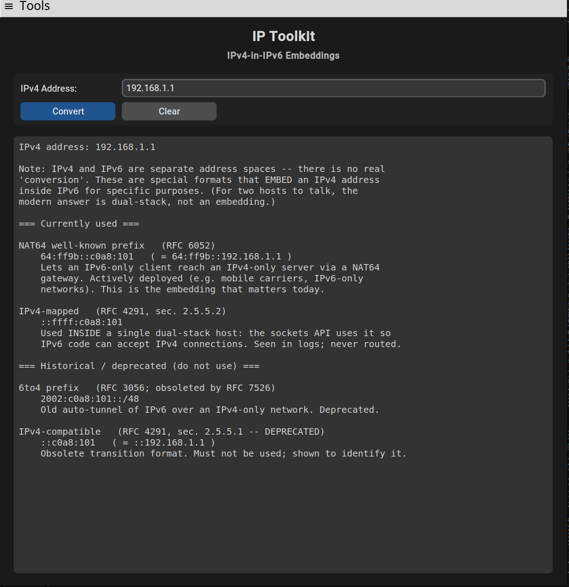

# IP Toolkit

> **Version 0.8.0 (alpha)**

A dark-themed desktop app bundling seven small **IPv6 / IPv4 networking tools** into
one window — subnet math, random address generation, conversions, and IPv4-in-IPv6
embeddings. Built to be *useful and educational*: results come with plain-English
notes and the relevant RFC references.

> Built with Python + [CustomTkinter](https://github.com/TomSchimansky/CustomTkinter).
> All address math uses the Python standard library (`ipaddress`) — no heavyweight
> dependencies.



## Features

Pick a tool from the **Tools** menu; each swaps the input row and shares one output box.
The app opens on the **IPv6 Calculator**.

| Tool | What it does |
|------|--------------|
| **IPv6 Calculator** | Network address, first/last address, prefix length, total count, compressed + exploded forms. |
| **IPv4 Calculator** | Network ID, broadcast, netmask, wildcard, usable hosts, host range (handles `/31` and `/32`). |
| **Prefix Converter** | Prefix length → address count, hex netmask, and `/64` subnet count; plus compressed ↔ exploded address forms. |
| **Random Address Generator** | 1–100 random addresses per click, from your own prefix, documentation space (`2001:db8::/32`) or ULA space (`fd00::/8`). The prefix field applies to **Host in prefix** mode only and takes an IPv6 network; blank → global unicast (`2000::/4`). |
| **IPv4 → Hex** | An IPv4 address as colon-hex (`c0:a8:01:01`), packed hex, `0x` form, and decimal. |
| **IPv4-in-IPv6 Embeddings** | How an IPv4 address is embedded in IPv6: **NAT64** (current) and IPv4-mapped, plus the deprecated 6to4 / IPv4-compatible forms — with an explanation that this isn't a real "conversion." |
| **Embed IPv4 in Prefix** | Place an IPv4 into an IPv6 prefix's low 32 bits, shown in hex and dotted-IPv4 forms, with a live documentation-range example. |

### Design highlights
- **Guard rail — never enumerates.** IPv6 networks can hold quintillions of addresses,
  so the app only *indexes* (`net[0]`, `net[-1]`, a random index) and reads
  `net.num_addresses`. It never builds an address list, so it can't hang or exhaust memory.
- **Dark UI** — the app itself is dark throughout; the native menu bar follows your
  OS theme, so it may appear light (as in the screenshot above).
- **No pop-ups** — the `≡` menu (About / Python Libraries / GitHub / RFC References,
  plus Exit) prints into the shared output box.
- **Teaches as it works** — e.g. the ULA generator explains why only `fd00::/8` is usable.
- **HiDPI-aware on Linux** — CustomTkinter scales itself on Windows and macOS but not
  on Linux, so the app detects the display DPI itself. See
  [Display scaling](#display-scaling).

## Requirements

- **Python 3.9+** (developed and tested on 3.12)
- **CustomTkinter** (installed via `requirements.txt`; everything else — `ipaddress`,
  `random`, `tkinter` — ships with Python)
- **Linux only:** some distributions ship Python without `tkinter`. On Debian/Ubuntu,
  install it with `sudo apt install python3-tk`.

## Installation & Usage

```bash
# 1. Clone
git clone https://github.com/confignomad/ip-toolkit.git
cd ip-toolkit

# 2. (Recommended) create a virtual environment
python -m venv .venv
# Windows:
.venv\Scripts\activate
# macOS/Linux:
source .venv/bin/activate

# 3. Install dependencies (CustomTkinter to run, pytest for development)
pip install -r requirements.txt

# 4. Run
python ip-toolkit.py
```

## Display scaling

CustomTkinter sizes its widgets in **pixels** and multiplies them by a DPI factor it
detects per platform. It reads the real DPI on Windows and defers to the OS on macOS,
but on Linux it hardcodes `1.0` (*"DPI awareness on Linux not implemented"*). On a
HiDPI Linux screen that left every control at 1× while the OS-drawn menu bar scaled
normally — the app looked tiny beside its own menu.

IP Toolkit now works the factor out from the display's reported DPI (`DPI ÷ 96`) and
applies it on Linux only, leaving Windows and macOS to CustomTkinter. Scaling is only
ever increased, never reduced, so a standard 96 DPI display behaves exactly as before.

If your display reports the wrong DPI — common when the desktop applies its own scale
factor instead — override it:

```bash
IP_TOOLKIT_SCALING=1.5 python ip-toolkit.py   # 1.0 = unscaled; accepts 0.5–4.0
```

The output box also picks the first monospace family actually installed (Consolas,
Cascadia Mono, Menlo, DejaVu Sans Mono, Liberation Mono, Noto Sans Mono, Courier New)
rather than asking for Consolas and letting Tk substitute silently.

### Window size

The window measures the output font at startup and opens wide enough for 74 columns
— the widest line any tool produces — and 30 rows, capped at 90% of the screen. The
old fixed `660x520` was narrower than the widest output at *every* scaling, so long
lines always wrapped; the size now follows the font instead of the other way round.

### Zooming

| Shortcut | Effect |
|----------|--------|
| **Ctrl +** (or **Ctrl =**) | Larger |
| **Ctrl −** | Smaller |
| **Ctrl 0** | Back to the detected scaling |

Zoom multiplies the display scaling rather than resizing one font, so the input
fields, buttons, labels and output text all grow together and the window resizes to
match. Each press is ±10%, within 0.6×–2.0× of the detected scaling; it resets on
restart. Use `IP_TOOLKIT_SCALING` above to change the starting point permanently.

## Testing

The address math lives in plain functions with no GUI code, so the suite runs
headlessly (no display needed):

```bash
pytest
```

`tests/test_ip_toolkit.py` covers all seven tools' logic — subnet math, the
`/31` and `/32` edge cases, generator ranges, the IPv4-in-IPv6 embeddings, and
the mixed hex/dotted notation round-trip — plus every error path.

## Tips
- Press **Enter** in any input field to run the current tool — no need to reach for
  the button. Every tool also has a **Clear** button that empties the output box.
- **Ctrl +** / **Ctrl −** / **Ctrl 0** zoom the whole window — see
  [Zooming](#zooming).
- On **Windows and Linux**, every input field supports **Cut / Copy / Paste /
  Select All** via right-click, plus the usual Ctrl+X/C/V and Ctrl+A.
- Use the **documentation** generator (`2001:db8::/32`, RFC 3849) for examples,
  screenshots, and teaching — those addresses are reserved and never routed.

## Standards referenced
RFC 8200 (IPv6), 4291 (addressing), 5952 (text representation), 4193 (ULA),
3849 (documentation), 6052 (NAT64), 3056 (6to4), 7526 (6to4 deprecation),
4632 (CIDR).

## Author
Developed and designed by **Ron Staples**.

## License
No license is set yet. Until one is added, all rights are reserved — if you'd like
others to reuse it, consider adding an [MIT](https://choosealicense.com/licenses/mit/)
or similar license.
